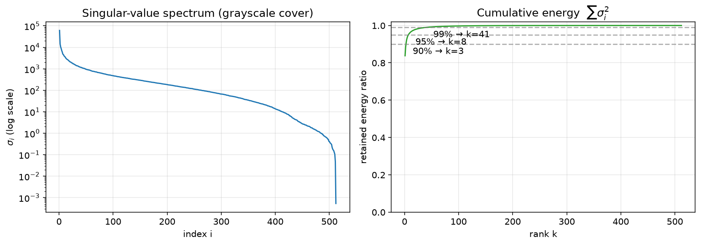
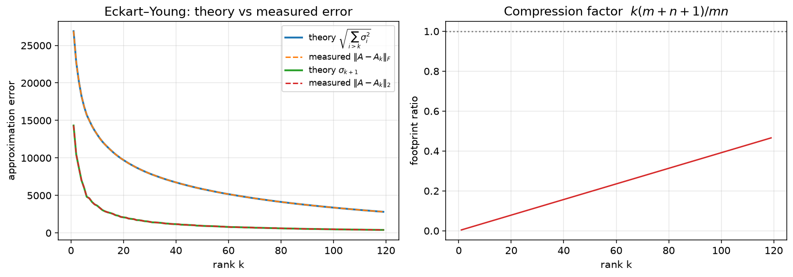
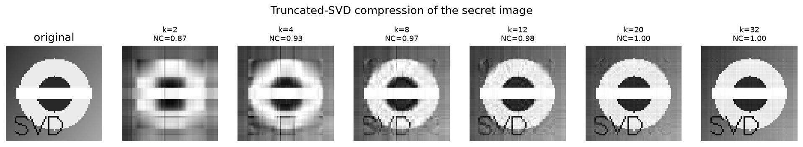
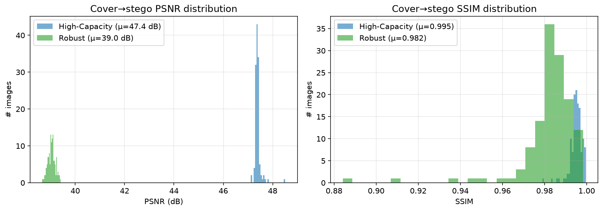
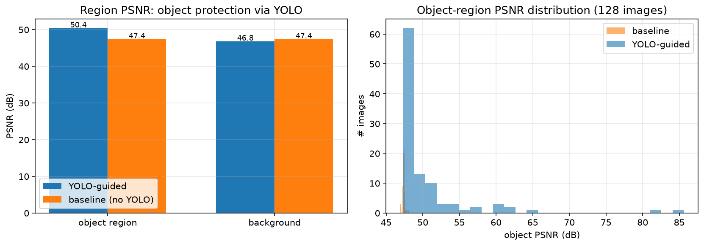
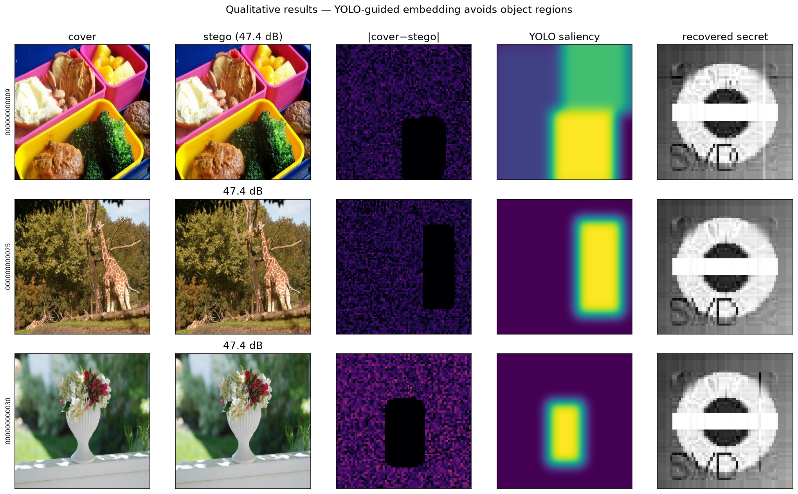
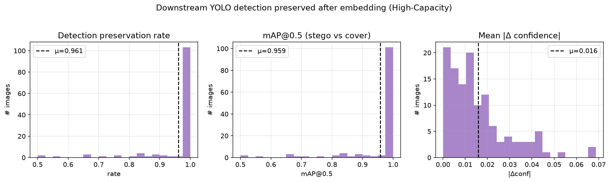
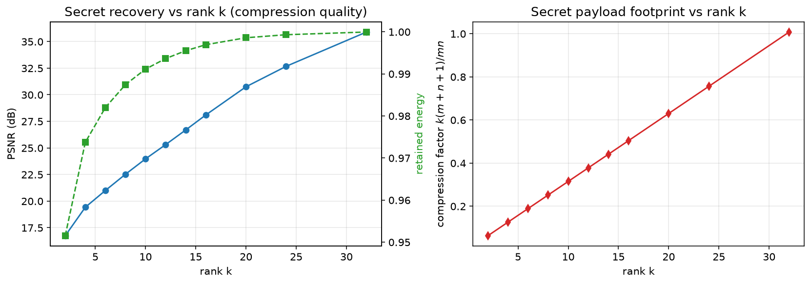
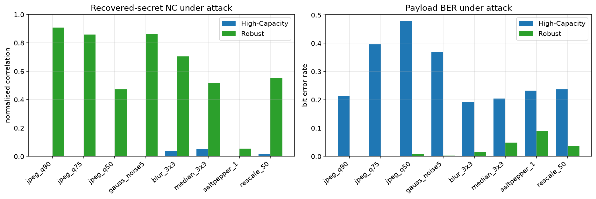
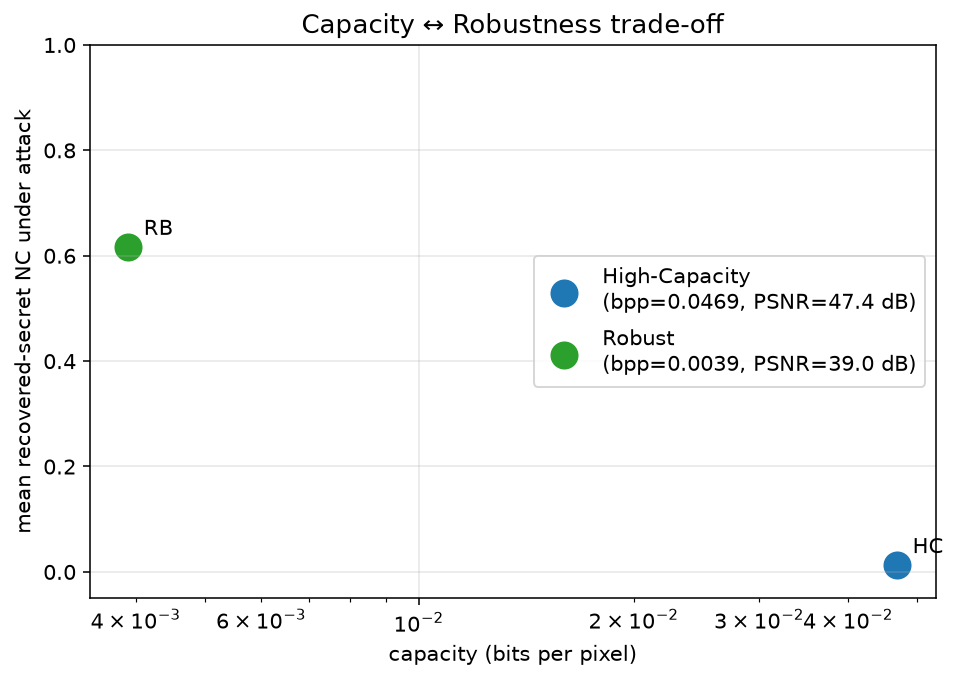

# SVD & YOLO per la Steganografia di Immagini

*Progetto d'esame — Statistical and Mathematical Methods for AI*

Valutazione su **128 immagini** del dataset COCO-128. Rilevatore YOLO: attivo. Tutti i numeri di questo report sono generati automaticamente dai risultati sperimentali (`results/summary.json`).

## 1. Descrizione del problema

La **steganografia di immagini** consiste nel nascondere un'informazione segreta dentro un'immagine *cover* in modo che la presenza stessa del messaggio sia impercettibile. A differenza della crittografia (che rende il messaggio illeggibile ma evidente), la steganografia mira all'**invisibilità**.

Obiettivo del progetto: realizzare uno schema di steganografia che (i) sfrutti la **Decomposizione ai Valori Singolari (SVD)** — argomento centrale del corso — come strumento sia di *compressione* del segreto sia di *dominio di embedding*; e (ii) usi un rilevatore di oggetti **YOLO** per rendere l'occultamento *content-adaptive*, nascondendo i dati nello sfondo e preservando le regioni semanticamente importanti.

Tre requisiti guidano la valutazione, in tensione tra loro: **impercettibilità** (il cover non deve cambiare visibilmente), **capacità** (quanti bit possiamo nascondere) e **robustezza** (il segreto deve sopravvivere a manipolazioni come la ricompressione JPEG).

## 2. Metodo e background teorico

### 2.1 SVD e teorema di Eckart–Young

Per ogni matrice A ∈ ℝ^(m×n) vale A = U Σ Vᵀ con U, V ortogonali e Σ = diag(σ₁,…,σ_r), σ₁ ≥ … ≥ σ_r > 0. La SVD troncata A_k = Σ_{i=1}^{k} σ_i u_i v_iᵀ è, per il teorema di Eckart–Young, la migliore approssimazione di rango k sia in norma spettrale (‖A−A_k‖₂ = σ_{k+1}) sia di Frobenius (‖A−A_k‖_F = (Σ_{i>k} σ_i²)^½).

*Spettro dei valori singolari di un cover ed energia cumulata: poche componenti catturano la quasi totalità dell'energia.*

*Verifica numerica del teorema di Eckart–Young (teoria vs misura) e fattore di compressione k(m+n+1)/mn.*

### 2.2 Compressione del segreto (riduzione di dimensionalità)

Il segreto S viene sostituito dalla sua approssimazione di rango k e memorizzato nei fattori compatti (U_k, σ_k, V_kᵀ). Il payload passa da m·n a k(m+n+1) numeri: è la stessa compressione con perdita vista a lezione (slide 'Reduction of memory occupation'). I fattori sono quantizzati (U,V a int8, σ a float16) per ridurre ulteriormente il payload.

*Ricostruzione del segreto al variare del rango k: aumentando k migliora la fedeltà (NC) ma cresce il payload.*

### 2.3 Ruolo dei valori singolari nell'embedding

La scelta di codificare l'informazione nei valori singolari — e in particolare in σ₁ — discende da quattro proprietà. (i) **Concentrazione di energia**: per i blocchi B×B di immagini naturali σ₁² raccoglie il 95–99 % dell'energia ‖A‖_F² = Σσᵢ² (Eckart–Young): σ₁ è la coordinata più significativa del blocco nella base di matrici di rango 1 {uᵢvᵢᵀ}. (ii) **Stabilità**: per il teorema di Weyl (§2.5) una perturbazione E sposta tutti i σᵢ al più di ‖E‖₂ in assoluto, quindi la perturbazione *relativa* è minima su σ₁ e massima sui σᵢ piccoli — in linea con l'osservazione del corso per cui i piccoli valori singolari amplificano il rumore. Un bit scritto in un σᵢ piccolo sarebbe illeggibile già dopo un attacco lieve. (iii) **Invarianza geometrica**: i σᵢ non cambiano per trasformazioni ortogonali del blocco, sono un descrittore intrinseco dell'energia. (iv) **Distorsione distribuita**: variare σ₁ di δ cambia il blocco di δ·u₁v₁ᵀ con ‖δ·u₁v₁ᵀ‖_F = |δ|, spalmato su tutti i B² pixel lungo la componente più liscia del blocco; modificare un σᵢ piccolo inietterebbe invece componenti oscillanti simili a rumore, più visibili e più facili da rilevare.

### 2.4 Embedding e decodifica (QIM su σ₁)

**Embedding.** Il segreto compresso è serializzato in un bitstream auto-descrittivo: header di 9 byte (magic, versione, h, w, k), poi i k valori singolari in float16 e i fattori U_k, V_kᵀ quantizzati a int8 (le loro colonne/righe hanno norma unitaria, quindi elementi in [−1,1] e scala fissa 127). La lunghezza totale, 9+2k+k(h+w) byte, dipende solo da (h,w,k). Il cover è diviso in blocchi B×B; l'ordine dei blocchi è fissato da una chiave PRNG e dalla mappa di priorità YOLO (sfondo prima). Per ogni blocco portante A = UΣVᵀ il bit b è codificato per Quantisation Index Modulation: σ₁' = ⌊σ₁/Δ⌋·Δ + 0.25Δ (b=0) oppure + 0.75Δ (b=1), e il blocco è ricostruito come A' = UΣ'Vᵀ (i vettori singolari restano invariati). I due offset sono i centri delle due semicelle dell'intervallo di quantizzazione: la scelta rende simmetrico e massimo il margine di errore, pari a Δ/4. Con ridondanza R>1 ogni bit logico è scritto in R siti consecutivi (codice a ripetizione).

**Decodifica (cieca).** L'estrazione non richiede né il cover originale né i σ originali (a differenza dello schema di Liu–Tan, che conserva U,V ed è per questo vulnerabile a false estrazioni): servono solo chiave, parametri (B,Δ,R) e la mappa di priorità. Si ricostruisce lo stesso ordinamento dei blocchi; per ciascun blocco si calcola la SVD e si decide dalla parte frazionaria di σ₁/Δ: b=0 se (σ₁/Δ mod 1) < 0.5, b=1 altrimenti — la cella di decisione è larga Δ/2 e il valore embedded siede al suo centro. Con R>1 il bit logico è il voto di maggioranza degli R siti. Si leggono prima i 72 bit dell'header, se ne valida la plausibilità e da (h,w,k) si determina la lunghezza esatta del payload; quindi si de-serializzano σ̃ (float16) e Ũ_k, Ṽ_kᵀ (int8/127) e si ricostruisce Ŝ = Ũ_k·diag(σ̃)·Ṽ_kᵀ con clip in [0,255]. Il parser è difensivo: σ corrotti (NaN/inf) vengono azzerati, così la componente danneggiata viene eliminata e la ricostruzione degrada al rango inferiore invece di esplodere.

### 2.5 Effetto delle perturbazioni: teorema di Weyl

Un attacco trasforma il blocco stego A' in A'+E. Il teorema di Weyl limita lo spostamento di ogni valore singolare: |σᵢ(A'+E) − σᵢ(A')| ≤ ‖E‖₂ ≤ ‖E‖_F. Ne segue la **condizione di decodifica corretta**: il bit QIM resta corretto se ‖E‖₂ < Δ/4. Per rumore gaussiano i.i.d. con deviazione σ_n la teoria delle matrici casuali dà ‖E‖₂ ≈ 2σ_n√B; con σ_n = 5 (attacco gauss_noise5) si prevede: HC (B=8, margine Δ/4 = 6 contro ‖E‖₂ ≈ 28) → molti bit ribaltati; RB (B=16, margine 32 contro ≈ 40) → errori sporadici corretti dal voto di maggioranza. È esattamente ciò che la tabella di robustezza (§5.5) misura: i risultati sperimentali sono previsti dalla teoria delle perturbazioni, non solo osservati. Sulla **ricostruzione**, l'errore totale ‖S−Ŝ‖_F si decompone in tre contributi: troncamento (Eckart–Young: (Σ_{i>k}σᵢ²)^½, il tetto di fedeltà in pulito), quantizzazione dei fattori (trascurabile) ed errori di bit, il cui effetto è fortemente non uniforme: un bit errato su U/V altera un solo elemento int8 (degrado graduale), un bit sugli esponenti di un σ float16 può amplificare la componente per ordini di grandezza (mitigato dall'azzeramento dei σ implausibili), un bit sull'header è fatale — per questo l'header occupa i primi siti dell'ordinamento ed è protetto dalla ripetizione. Questa gerarchia spiega perché la NC crolla in modo non lineare al crescere del BER e perché la modalità robusta richiede il codice a ripetizione.

### 2.6 Guida YOLO (content-adaptive)

YOLOv8 rileva gli oggetti nel cover; dalle bounding box si costruisce una mappa di saliency. L'ordine di riempimento dei blocchi privilegia lo **sfondo** (saliency bassa), lasciando quasi intatte le regioni degli oggetti. YOLO viene poi usato anche per **valutare** quanto le detection si conservano sul cover rispetto allo stego (preservation rate, IoU, mAP@0.5).

## 3. Implementazione

Il progetto è in Python (NumPy, OpenCV, scikit-image, Ultralytics YOLOv8, Matplotlib). Moduli principali: `svd_core` (matematica SVD), `steganography` (codec del segreto + embedding/estrazione), `yolo_guidance` (rilevamento e metriche), `metrics`, `attacks`, `dataset`, `pipeline`.

Sono definiti due **punti operativi** che illustrano il compromesso capacità↔robustezza:

| Parametro | High-Capacity (HC) | Robust (RB) |
|---|---|---|
| Blocco SVD | 8×8 | 16×16 |
| Passo QIM Δ | 24.0 | 128.0 |
| Ripetizione R | 1 | 3 |
| Segreto | 64×64, k=10 | 16×16, k=3 |
| Capacità (bpp) | 0.0469 | 0.0039 |

### 3.1 Motivazione teorica della scelta dei parametri

**Passo Δ.** Assumendo la fase σ₁ mod Δ uniforme (vero per σ₁ ≫ Δ) e bit equiprobabili, lo spostamento δ di σ₁ in embedding ha E[δ²] = 7Δ²/48; la modifica di norma |δ| si spalma su B² pixel e solo una frazione α dei blocchi porta bit, quindi il PSNR atteso è 10·log₁₀(255²·B²/(α·7Δ²/48)). La predizione coincide con la misura: HC α = 0.85 → PSNR atteso 47.6 dB contro 47.4 dB misurati; RB α = 0.87 → atteso 39.0 dB contro 39.0 dB (scarto < 0.3 dB, dovuto ad arrotondamento e clipping a uint8): la distorsione è interamente governata dalla teoria. Sul lato robustezza, la condizione di Weyl Δ/4 > ‖E‖₂ ≈ 2σ_n√B dà la regola di progetto Δ > 8σ_n√B: RB (Δ=128.0, margine 32) tollera per costruzione rumore con σ_n ≈ 4, HC (Δ=24.0, margine 6) solo σ_n ≈ 0.75 — la fragilità di HC è il prezzo, scelto, del massimo PSNR e capacità.

**Blocco B.** I siti portanti sono 3(N/B)²: dimezzare B quadruplica la capacità (12288 siti con B=8 contro 3072 con B=16). Per la robustezza vale l'argomento opposto: per un blocco quasi costante di livello c si ha σ₁ ≈ cB, che cresce linearmente in B, mentre la perturbazione attesa 2σ_n√B cresce solo come √B — i blocchi grandi tollerano passi Δ più ampi in rapporto a σ₁, e la loro componente u₁v₁ᵀ è a frequenza più bassa, quindi sopravvive meglio a blur e JPEG.

**Rango k del segreto.** Due vincoli: il criterio dell'energia del corso (il più piccolo k con E(k) sopra soglia — per il segreto 64×64, E(8) = 98.7 %, E(10) = 99.1 %: k=10 è il più piccolo rango con energia ≥ 99 %) e il vincolo di capacità 8·[9+2k+k(h+w)]·R ≤ 3(N/B)². In HC k=10 richiede 10472 bit su 12288 (utilizzo 85 %), mentre k=12 non entrerebbe (12552 bit); in RB k=3 richiede 888×3 = 2664 bit su 3072, mentre k=4 non entrerebbe (3480). In HC k è scelto dall'energia, in RB è il massimo rango compatibile con la ridondanza.

**Ripetizione R.** R è dispari perché il voto di maggioranza non ammetta pareggi. Se p è la probabilità di errore del singolo sito, con R=3 l'errore sul bit logico è 3p²(1−p)+p³ ≈ 3p²: un canale con p = 5 % scende allo 0.7 %. È il salto qualitativo tra le colonne HC e RB della tabella di robustezza, pagato con 1/3 della capacità; R=3 è il minimo dispari > 1, e valori maggiori renderebbero il payload RB incompatibile con la capacità.

## 4. Setup sperimentale

- Dataset: COCO-128 (128 immagini reali di COCO), cover ridimensionati a 512×512.
- Segreto: logo grayscale sintetico (forme + gradiente), compresso via SVD troncata.
- Metriche di fedeltà: PSNR, SSIM, MSE (cover vs stego), globali e per regione (oggetto vs sfondo).
- Metriche di payload: NC (correlazione normalizzata) e PSNR del segreto recuperato, BER.
- Downstream: preservation rate, IoU medio, mAP@0.5, |Δconfidenza| (cover vs stego).
- Attacchi: JPEG (q90/q75/q50), rumore gaussiano, blur, mediano, sale&pepe, rescale.

## 5. Risultati

### 5.1 Impercettibilità

In modalità HC il cover e lo stego sono praticamente indistinguibili: PSNR medio **47.39 dB**, SSIM **0.9950**. In modalità RB (più robusta) PSNR medio **39.04 dB**, SSIM **0.9820**.

*Distribuzione di PSNR e SSIM cover→stego sulle immagini di test.*

### 5.2 Protezione degli oggetti tramite YOLO

La guida YOLO sposta il payload nello sfondo: il PSNR **nelle regioni degli oggetti** sale da 47.40 dB (baseline senza YOLO) a **50.39 dB** (guidato), un miglioramento di **2.99 dB** esattamente dove l'occhio (e il rilevatore) guardano. Lo sfondo, di contro, passa da 47.40 a 46.82 dB.

*PSNR per regione (oggetto vs sfondo): la guida YOLO protegge gli oggetti.*

*Risultati qualitativi: la mappa |cover−stego| mostra che le modifiche evitano le regioni degli oggetti.*

### 5.3 Preservazione del contenuto semantico (downstream)

Le detection di YOLO si conservano quasi perfettamente dopo l'embedding: preservation rate medio **0.961**, mAP@0.5 medio **0.959**, variazione media di confidenza **0.016**. Lo stego è quindi utilizzabile in una pipeline di AI a valle senza degradarne le prestazioni.

*Distribuzione di preservation rate, mAP@0.5 e |Δconfidenza|.*

### 5.4 Recupero del segreto e compressione SVD

Su immagine non attaccata, il segreto si recupera con NC medio **0.923** (HC) e **0.929** (RB), con BER ≈ 0.00150 (HC). Il limite di fedeltà in pulito è dato dalla **compressione SVD troncata** del segreto, non dall'estrazione: aumentando k la qualità cresce a scapito del payload.

*Qualità di ricostruzione (PSNR/energia) e fattore di compressione del segreto al variare del rango k.*

### 5.5 Robustezza agli attacchi

La modalità RB (blocchi 16×16, Δ grande, ripetizione ×3) resiste agli attacchi comuni, mentre la modalità HC — priva di ridondanza — è fragile: è il prezzo della massima capacità.

| Attacco | NC (HC) | NC (RB) | BER (HC) | BER (RB) |
|---|---|---|---|---|
| jpeg_q90 | 0.000 | 0.908 | 0.215 | 0.001 |
| jpeg_q75 | 0.000 | 0.859 | 0.396 | 0.002 |
| jpeg_q50 | 0.000 | 0.471 | 0.478 | 0.009 |
| gauss_noise5 | 0.000 | 0.863 | 0.368 | 0.003 |
| blur_3x3 | 0.039 | 0.705 | 0.192 | 0.016 |
| median_3x3 | 0.051 | 0.515 | 0.204 | 0.049 |
| saltpepper_1 | 0.000 | 0.054 | 0.233 | 0.089 |
| rescale_50 | 0.014 | 0.552 | 0.237 | 0.036 |

*NC del segreto recuperato e BER del payload sotto attacco.*

*Fronte di Pareto capacità↔robustezza tra le due modalità.*

## 6. Analisi e commenti

- Il valore singolare massimo σ₁ è un dominio di embedding eccellente: concentra l'energia del blocco (Eckart–Young) e, per il teorema di Weyl, è la componente con perturbazione relativa minima — in linea con l'osservazione del corso che i piccoli σ amplificano il rumore.
- Il PSNR misurato coincide (entro 0.3 dB) con quello previsto dalla formula teorica 10·log₁₀(255²·B²/(α·7Δ²/48)): la distorsione dell'embedding è interamente spiegata dalla teoria (§3.1).
- La guida YOLO migliora la qualità nelle regioni salienti (+3.0 dB sugli oggetti) senza intaccare la capacità, e mantiene mAP ≈ 0.96.
- Esiste un chiaro compromesso capacità↔robustezza governato da tre leve SVD (dimensione blocco, passo Δ, ridondanza R): non è possibile massimizzare contemporaneamente capacità, impercettibilità e robustezza.
- La compressione del segreto via SVD troncata abilita payload elevati ma, eliminando la ridondanza spaziale, rende il recupero sensibile agli errori di bit: per la robustezza è necessaria una codifica di canale (ripetizione).

## 7. Conclusioni

Il progetto mostra come la SVD — cuore del corso — fornisca un quadro unificato per la steganografia: compressione del segreto (Eckart–Young), dominio di embedding robusto (σ₁), e analisi del condizionamento. L'integrazione con YOLO rende l'occultamento adattivo al contenuto e verificabile a valle. I risultati su 100+ immagini COCO quantificano impercettibilità, preservazione semantica e il compromesso capacità↔robustezza.

## Riferimenti

- C. Eckart, G. Young, 'The approximation of one matrix by another of lower rank', Psychometrika, 1936.
- H. Weyl, 'Das asymptotische Verteilungsgesetz der Eigenwerte linearer partieller Differentialgleichungen', Math. Ann., 1912 (disuguaglianze di perturbazione dei valori singolari).
- B. Chen, G. Wornell, 'Quantization Index Modulation: a class of provably good methods for digital watermarking and information embedding', IEEE Trans. Inf. Theory, 2001.
- G. H. Golub, C. Van Loan, 'Matrix Computations', 4th ed., 2013.
- R. Liu, T. Tan, 'An SVD-based watermarking scheme for protecting rightful ownership', IEEE Trans. Multimedia, 2002.
- G. Jocher et al., 'Ultralytics YOLOv8', 2023.
- T.-Y. Lin et al., 'Microsoft COCO: Common Objects in Context', ECCV 2014.
- M. Popolizio, slide del corso 'Reducing data dimensionality for AI applications', 2025.
